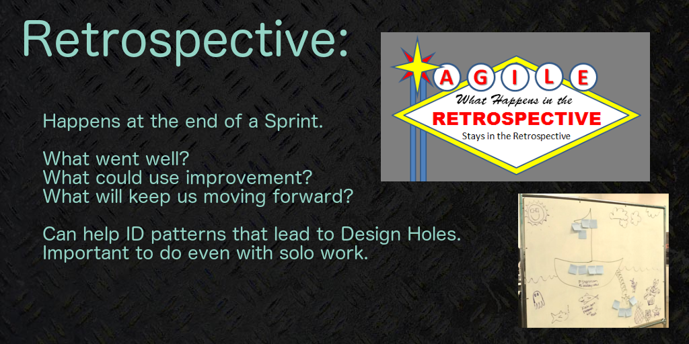

Project Management for Independent Developers
===

[https://github.com/devjanaprime/glitchcon17_projectManagementForIndies](https://github.com/devjanaprime/glitchcon17_projectManagementForIndies)

The Menu:
---
- [Who Are We?](#who)
- [Why Project Management?](#why-project-management)
- [Lessons Learned](#lessons-learned)
- [What can you do and How can it get done?](#what-and-how)
- [Indie Game Dev Specific Concerns](#indie-game-dev-specific-concerns)
- [Endcap](#endcap)

Who Are We?
===

 

[DevNAri](http://devnari.com)
===

Ari Carrillo
---
- President of Visuals and Playtime at DevNAri
- 3D Artist, Axonom
- prior: Department Chair of Game Design at Brown College 

Dev Jana
---
- [@devjana](https://twitter.com/devjana)
- President of Code and Noises at DevNAri
- Director of Instruction: Full Stack Development at Prime Digital Academy
- Prior: Project Manager at Image Metrics, Tech. Dir. of R&D at Preferred Interactive, Tech. Dir. at BioLucid, Ast. Prof. of Game Design at Champlain College, Department Chair of Game Design at Collins College, Sound Designer at CME/MGM Interactive, Ast. Department Chair of Game Design at Brown College.

Why Project Management?
===

 
 
 

 
Help generate/maintain:
---
- Momentum
- Scheduling
- Communication
- Focus
 
Helps avoid/mitigate:
---
- issues lost to the ether
- feature creep
- design holes
- big balls of mud

---

---

Lessons Learned
===
- DNA
- open floor anecdotes

What and How
===
Agile practices
---
 - stand ups
 - sprints
 - retrospectives 

Scrum
---
 - Board
 - Hierarchy 

Workflow
---
 - basic v. realistic 
 
 ---
 
 

Agile/Scrum syntax and methodologies for breaking a project into manageable portions:

- Epic: HIGH level objective. Large bucket into which at least one feature will live
- Story: (“user stories”) Often start with “I want…” and describe actions available for the user.
- Task: um… a task that needs to be completed
- Subtask: part of a larger task

Example 0:

- Epic: Player Profiles
- Story: I want to log in
- Tasks: Login UI 
- Related sub-tasks: images for buttons, finalize copy text, code to display in engine

 
 
 
 
 
 

Indie Game Dev Specific Concerns
===

_*How do we be creative and stay on track while implementing PM in indie projects?*_

Endcap
===
- retrospective

Stretch Goals
---
 

 

- burn down

C-Ya
---

facebook: [devnari](https://facebook.com/devnari)
twitter: [@dnanewtone](https://twiter.com/dnanewtone)

[https://github.com/devjanaprime/glitchcon17_projectManagementForIndies](https://github.com/devjanaprime/glitchcon17_projectManagementForIndies)

Please take _60-seconds_ and tell us about your experience in this session!
=

[http://bit.ly/gc17survey](http://bit.ly/gc17survey)
